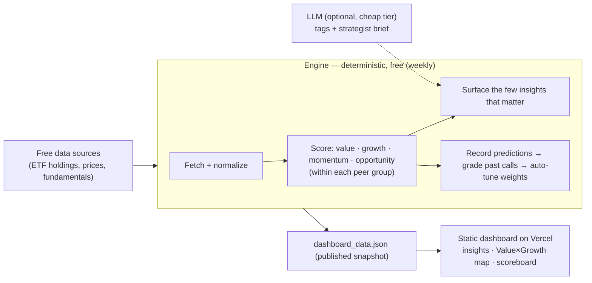

# Global Index Valuation Agent

**Where is the world's equity value — and where's the opportunity?**
A cost-effective research agent that ranks **~90 global market indices** by *value* and
*fundamental growth*, surfaces the handful of calls worth your attention, and learns
from whether its past calls actually played out — so you spend a minute, not an afternoon.

[](https://global-index-valuation-agent.vercel.app)
[](LICENSE)
[](requirements.txt)
&nbsp;·&nbsp; **[▶ Live demo](https://global-index-valuation-agent.vercel.app)** ·
**[Architecture](docs/ARCHITECTURE.md)** · **[Data-ingestion agent](docs/DATA_INGESTION.md)**

> [!WARNING]
> **For research/education only — not investment advice.** The rankings are
> **experimental and unvalidated** (no backtest yet — see [roadmap](#status--roadmap)).
> Do your own research. See [DISCLAIMER.md](DISCLAIMER.md).

---

## What it is

Most equity tools are either **data terminals you dig through** (Bloomberg, Koyfin, TIKR)
or **opaque ratings that never show whether they worked** (Simply Wall St, Stockopedia).
This is neither. It is an **agent that does the research for you** and shows its work:

- It sources every major index, computes valuation + **fundamental** growth, and ranks
  markets **within their peer group** (countries vs countries, sectors vs sectors).
- It surfaces the few things that matter — *cheapest value*, *highest fundamental
  growth*, and the **GARP sweet spot** (cheap **and** growing) — at the top.
- It records every call against a **fixed date** and grades itself against what the
  market actually did, so the track record is public and falsifiable.

Try it: **<https://global-index-valuation-agent.vercel.app>** (the strategist read, the
insight cards, and the Value × Growth map are the one-minute answer).

## Why it's different (the wedge)

1. **Top-down + bottom-up in one view.** "Which *market* is cheap & growing" and (Phase 2)
   "which *stock* within it" on one globally-comparable scale. Most tools are stock-only
   or single-market.
2. **A 1-minute answer, not a terminal.** Insights rise to the top; filters are there if
   you want to dig.
3. **A transparent, self-validating track record.** It grades its own calls in the open.
4. **Cost-engineered to run for ~$0.** The expensive model never touches the raw data.

---

## How it works



**The deterministic spine.** Fetching, parsing, computing P/E and other metrics, scoring,
ranking, and grading are all plain Python — free, exact, auditable. The LLM is optional
and only ever narrates the final ≤90-row scoreboard. With no API key the product still
runs end-to-end for **$0** (deterministic fallbacks fill in the text).

**The scores** (all ranked *within* a peer-group `kind`, so adding US sectors never
distorts the country comparison):

| Score | Question it answers |
|---|---|
| **Value** | Is it cheap? (P/E, P/B, P/S, yields — with value-trap guards) |
| **Growth** | Are the underlying **fundamentals** growing? (revenue + earnings growth of the top holdings + forward estimates — **not** price momentum) |
| **Opportunity (GARP)** | Cheap **and** growing **and** not overvalued? (value 40% · growth 40% · momentum 12% · mean-reversion 8%) |

**Two feedback loops** make it an agent, not a report:
- **Market feedback** — every run records a prediction; later runs grade it (rank-IC,
  hit-rate) and the [auto-tuner](engine/tuning.py) nudges the weights toward what worked.
- **User feedback** — pin / dismiss / rate, which re-weights what surfaces next.

**Cost model — right model for the right task.** Deterministic work is free; LLM work is
routed by frequency × stakes: cheap/owned models (self-hosted Qwen, GLM-4-Flash,
DeepSeek) for frequent customer-facing calls, frontier models only for the rare weekly
synthesis. Full design in [docs/ARCHITECTURE.md](docs/ARCHITECTURE.md#2-the-model-routing-strategy-the-cost-lever).

---

## The two agents

This repo contains two cooperating agents:

1. **The valuation engine** (`engine/`) — the product above. Sources indices, scores
   them, surfaces insights, grades itself, and publishes the dashboard.
2. **The [data-ingestion agent](docs/DATA_INGESTION.md)** (`engine/dataagent/`) — its sole
   job is to keep the data good: it discovers candidate sources, **probes them** for
   coverage / cleanliness / freshness / **license**, scores them, and rewires which
   source feeds each need. It ships a backlog of 40 research-verified, license-clean
   sources (`engine/sources/seed_catalog.json`) and already flags that Yahoo is
   license-restricted and where the coverage gaps are.

---

## Quick start

```bash
python3 -m venv .venv && source .venv/bin/activate
pip install -r requirements.txt

# 1. Build the data (fetch + score + grade + write data/dashboard_data.json)
python -m engine.cli refresh

# 2. Launch the dashboard  ->  http://localhost:8000
uvicorn engine.api:app --port 8000
```

Optional — turn on the LLM strategist narrative (otherwise it uses free deterministic text):
```bash
cp .env.example .env   # add ANTHROPIC_API_KEY (or a cheap model — see ARCHITECTURE.md)
```

Run the data-ingestion agent:
```bash
python -m engine.dataagent.cli run       # probe sources, score, rewire, report
python -m engine.dataagent.cli sources --leads   # the prioritized backlog of sources
```

## Project structure

```
engine/
  universe.py     # the ~90 indices (index -> liquid ETF proxy)
  datasource.py   # free data fetch + normalize + cache (the dumb layer)
  metrics.py      # value / growth / momentum / opportunity scores, ranked within kind
  surfacing.py    # picks the few insights worth surfacing (per kind)
  ledger.py       # prediction ledger + market-feedback accuracy
  tuning.py       # feedback-driven auto-tuning of the opportunity weights
  llm.py          # optional narration (cheap tags + smart brief); free fallbacks
  fundamentals.py # stock-level retrieval, routed through the ingestion agent's choice
  pipeline.py     # orchestration -> dashboard_data.json
  api.py / cli.py # FastAPI server + CLI
  sources/        # SourceAdapter interface, registry, adapters, seed_catalog.json
  dataagent/      # the data-ingestion agent (probe, score, decide, discover, cli)
dashboard/        # static, no-build UI (focus lens, Value×Growth map, scoreboard)
docs/             # ARCHITECTURE.md (target design) + DATA_INGESTION.md
.github/workflows/# weekly data refresh + daily data-source health
scripts/          # local cron helper
```

`data/dashboard_data.json` is the single contract between engine and UI. The hosted site
serves a committed snapshot of it and refreshes weekly via GitHub Actions.

---

## Status & roadmap

- **Phase 1 (live):** index-level valuation + fundamental growth across ~90 markets, an
  interactive dashboard, both feedback loops, auto-tuning, and the data-ingestion agent.
- **Honest caveats:** scores are **relative within each run**; the strategy has **not yet
  been backtested**, so treat it as experimental. Free Yahoo data is license-restricted
  (the ingestion agent is migrating to license-clean sources for the public build).
- **Next (designed, see [ARCHITECTURE.md](docs/ARCHITECTURE.md)):** an in-loop LLM agent
  (tools + memory + reflection), a validated learning model + **backtest**, multi-user
  backend + alerts, stock-level (Phase 2) data, and a self-hosted, auto-upgradeable model.

The [architecture doc](docs/ARCHITECTURE.md) includes a measurable "definition of
agentic" checklist — today the system is *automated and instrumented*; the roadmap closes
the gap to *agentic*.

## Documentation

- **[docs/ROADMAP.md](docs/ROADMAP.md)** — the sequenced build plan: the two-tier data
  architecture (Postgres + Parquet/DuckDB), Phase 1 (cloud DB + stock-level data),
  backtesting methodology, and the news/macro context layer.
- **[docs/ARCHITECTURE.md](docs/ARCHITECTURE.md)** — the target-state design: 8 pillars,
  model-routing strategy, cost ladder, moat & monetization.
- **[docs/DATA_INGESTION.md](docs/DATA_INGESTION.md)** — the data-ingestion agent.

## Disclaimer

This software is provided for **informational and educational purposes only**. It is
**not** investment advice, a recommendation, or an offer to buy or sell any security. The
rankings are experimental and unvalidated, may contain errors, and rely on free data that
can be incomplete or wrong. Markets are risky; **do your own research** and consult a
licensed professional. The authors accept no liability for any use of this software. See
[DISCLAIMER.md](DISCLAIMER.md).

## License

[MIT](LICENSE) for the code. Market data is subject to each source's own terms — see the
license notes in `engine/sources/seed_catalog.json` and the data-ingestion agent.
