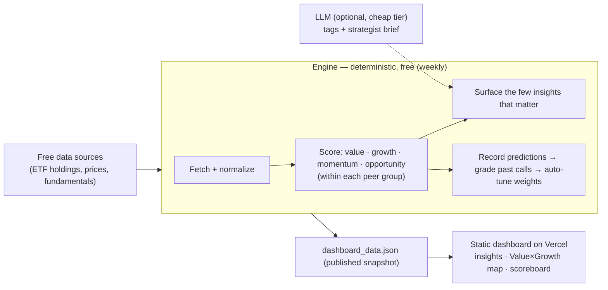

# Global Index Valuation Agent

**Where is the world's equity value — and where's the opportunity?**
A cost-effective research agent that ranks **~90 global market indices** by *value* and
*fundamental growth*, surfaces the handful of calls worth your attention, and learns
from whether its past calls actually played out — so you spend a minute, not an afternoon.

[](https://global-index-valuation-agent.vercel.app)
[](LICENSE)
[](requirements.txt)
&nbsp;·&nbsp; **[▶ Live demo](https://global-index-valuation-agent.vercel.app)** ·
**[Architecture](docs/ARCHITECTURE.md)** · **[Data-ingestion agent](docs/DATA_INGESTION.md)**

> [!WARNING]
> **For research/education only — not investment advice.** The rankings are
> **experimental and unvalidated** (no backtest yet — see [roadmap](#status--roadmap)).
> Do your own research. See [DISCLAIMER.md](DISCLAIMER.md).

---

## What it is

Most equity tools are either **data terminals you dig through** (Bloomberg, Koyfin, TIKR)
or **opaque ratings that never show whether they worked** (Simply Wall St, Stockopedia).
This is neither. It is an **agent that does the research for you** and shows its work:

- It sources every major index, computes valuation + **fundamental** growth, and ranks
  markets **within their peer group** (countries vs countries, sectors vs sectors).
- It surfaces the few things that matter — *cheapest value*, *highest fundamental
  growth*, and the **GARP sweet spot** (cheap **and** growing) — at the top.
- It records every call against a **fixed date** and grades itself against what the
  market actually did, so the track record is public and falsifiable.

Try it: **<https://global-index-valuation-agent.vercel.app>** (the strategist read, the
insight cards, and the Value × Growth map are the one-minute answer).

## Why it's different (the wedge)

1. **Top-down + bottom-up in one view.** "Which *market* is cheap & growing" and (Phase 2)
   "which *stock* within it" on one globally-comparable scale. Most tools are stock-only
   or single-market.
2. **A 1-minute answer, not a terminal.** Insights rise to the top; filters are there if
   you want to dig.
3. **A transparent, self-validating track record.** It grades its own calls in the open.
4. **Cost-engineered to run for ~$0.** The expensive model never touches the raw data.

---

## How it works



**The deterministic spine.** Fetching, parsing, computing P/E and other metrics, scoring,
ranking, and grading are all plain Python — free, exact, auditable. The LLM is optional
and only ever narrates the final ≤90-row scoreboard. With no API key the product still
runs end-to-end for **$0** (deterministic fallbacks fill in the text).

**The scores** (all ranked *within* a peer-group `kind`, so adding US sectors never
distorts the country comparison):

| Score | Question it answers |
|---|---|
| **Value** | Is it cheap? (P/E, P/B, P/S, yields — with value-trap guards) |
| **Growth** | Are the underlying **fundamentals** growing? (revenue + earnings growth of the top holdings + forward estimates — **not** price momentum) |
| **Opportunity (GARP)** | Cheap **and** growing **and** not overvalued? (value 40% · growth 40% · momentum 12% · mean-reversion 8%) |

**Two feedback loops** make it an agent, not a report:
- **Market feedback** — every run records a prediction; later runs grade it (rank-IC,
  hit-rate) and the [auto-tuner](engine/tuning.py) nudges the weights toward what worked.
- **User feedback** — pin / dismiss / rate, which re-weights what surfaces next.

**Cost model — right model for the right task.** Deterministic work is free; LLM work is
routed by frequency × stakes: cheap/owned models (self-hosted Qwen, GLM-4-Flash,
DeepSeek) for frequent customer-facing calls, frontier models only for the rare weekly
synthesis. Full design in [docs/ARCHITECTURE.md](docs/ARCHITECTURE.md#2-the-model-routing-strategy-the-cost-lever).

---

## Jobs and agents

We keep the terminology precise (see **[docs/AGENTS.md](docs/AGENTS.md)**):
- **Jobs** = deterministic Python (no LLM) — they do the work, run frequently, ~free.
- **Agents** = LLM-powered review that *improves the jobs* — infrequent. *(None are
  active yet — no model is configured.)*

**Jobs running today:**
1. **Valuation / scoring** (`engine/`) — sources indices, scores them, surfaces
   insights, grades itself, publishes the dashboard. *(weekly)*
2. **Data pipeline** (`engine/datapipeline.py`) — one sequenced job: probe sources →
   ingest fundamentals (SEC EDGAR) → tag stocks by sector → validate + auto-fix the
   KPI catalog → data-quality checks → recalibration check. Validation runs *right
   after* ingestion. *(daily)* See [docs/DATA_INGESTION.md](docs/DATA_INGESTION.md).

**Agents (LLM):** provider-agnostic with a **waterfall router** — each role has an
ordered chain (`scheme:model` → Ollama Cloud / Groq / DeepSeek / GLM / OpenRouter /
Anthropic) that falls through to the next tier on rate-limit or error, and degrades to
free deterministic text if every tier is down. **Activatable for $0** (local Ollama).
Shared, model-agnostic instructions live in version-controlled playbooks
(`engine/context/*.md`); model-specific reliability is **learned** from outcome metrics
(`model_scorecard`) and can reorder the chain. Full design in
[docs/MODEL_ROUTING.md](docs/MODEL_ROUTING.md). Source-discovery, sector-KPI research,
quality-triage, analyst, strategist — each with its cadence in
[docs/AGENTS.md](docs/AGENTS.md). They *improve* the jobs; they don't run in the hot path.

**Data foundation:** a cloud **Postgres** (Supabase) is the single source of truth;
**SEC EDGAR** ingests sector-aware, point-in-time stock-level fundamentals (110-KPI
catalog, restatement vintages). Two-tier storage (Postgres + Parquet/DuckDB) is in
[docs/ARCHITECTURE.md](docs/ARCHITECTURE.md); progress in [docs/STATUS.md](docs/STATUS.md).

---

## Quick start

```bash
python3 -m venv .venv && source .venv/bin/activate
pip install -r requirements.txt

# 1. Build the data (fetch + score + grade + write data/dashboard_data.json)
python -m engine.cli refresh

# 2. Launch the dashboard  ->  http://localhost:8000
uvicorn engine.api:app --port 8000
```

Optional — activate the LLM (otherwise free deterministic text + dormant agents):
```bash
cp .env.example .env
# Free + local ($0): install Ollama, then  ollama pull qwen2.5
#   and set  MODEL_CHEAP=ollama:qwen2.5  MODEL_AGENT=ollama:qwen2.5  in .env
# Or a key: ANTHROPIC_API_KEY / OPENROUTER_API_KEY (see docs/ARCHITECTURE.md, docs/AGENTS.md)
```

Cloud DB + data pipeline (needs `DATABASE_URL` in `.env` — Supabase):
```bash
python -c "from engine import db; db.apply_migrations()"   # apply schema
python -m engine.datapipeline            # probe -> ingest (EDGAR) -> tag -> validate -> QA
python -m engine.datapipeline --agents   # also run the LLM agents (needs a model)
```

## Project structure

```
engine/
  universe.py     # the ~90 indices (index -> liquid ETF proxy)
  datasource.py   # free index data fetch + normalize + local cache
  metrics.py      # value / growth / momentum / opportunity scores, ranked within kind
  surfacing.py    # picks the few insights worth surfacing (per kind)
  ledger.py       # prediction ledger + market-feedback accuracy (Postgres)
  tuning.py       # feedback-driven auto-tuning of the opportunity weights
  llm.py          # provider-agnostic model router (Ollama/DeepSeek/GLM/.../Anthropic)
  pipeline.py     # valuation orchestration -> dashboard_data.json
  datapipeline.py # the sequenced DATA pipeline job (probe->ingest->tag->validate->QA)
  db.py           # Postgres (Tier A) access + migration runner
  migrations/     # versioned SQL schema (0001..0005)
  quality.py      # data-quality checks (warnings + score)
  recalibration.py# decides when a backtest must be redone (backward recalibration)
  fundamentals.py # stock-level retrieval routed through the chosen source
  api.py / cli.py # FastAPI server + CLI
  sources/        # SourceAdapter interface, registry, adapters (EDGAR/SimFin/...),
                  #   seed_catalog.json (40 sources), metric_catalog.json (110 KPIs)
  dataagent/      # source probe/score/decide (job) + discover (agent)
  sectoragent/    # SIC tagging + catalog validation (job) + KPI research (agent)
dashboard/        # static, no-build UI (focus lens, Value×Growth map, scoreboard)
docs/             # STATUS, ROADMAP, ARCHITECTURE, AGENTS, DATA_INGESTION
.github/workflows/# data-pipeline (daily) + valuation refresh (weekly)
scripts/          # local cron helper
```

`data/dashboard_data.json` is the single contract between engine and UI. The hosted site
serves a committed snapshot of it and refreshes weekly via GitHub Actions.

---

## Status & roadmap

**Full current state: [docs/STATUS.md](docs/STATUS.md).** In short:
- **Live:** the index-level dashboard (public, on Vercel); a cloud **Postgres** data
  foundation (single source of truth); **SEC EDGAR** ingesting sector-aware, point-in-time
  stock-level fundamentals (110-KPI catalog, restatement vintages); the sequenced daily
  data-pipeline job; and **LLM agents activatable locally for $0** (Ollama).
- **Honest caveats:** scores are **relative within each run** and the strategy is **not yet
  backtested** — experimental. Free Yahoo data is license-restricted (migrating to
  license-clean sources, EDGAR-first).
- **Next:** ingest the S&P 500 (with agents), non-US fundamentals (EDINET/SimFin), Tier B
  (R2/Parquet for prices), then **Phase 2** — the backtest + validated ranking model.

The [architecture doc](docs/ARCHITECTURE.md) has a measurable "definition of agentic"
checklist; the roadmap closes the gap from *automated* to *agentic*.

## Documentation

- **[docs/STATUS.md](docs/STATUS.md)** — current state + what's next (start here).
- **[docs/ROADMAP.md](docs/ROADMAP.md)** — sequenced build plan; two-tier data
  architecture (Postgres + Parquet/DuckDB); backtesting + news/macro layer.
- **[docs/ARCHITECTURE.md](docs/ARCHITECTURE.md)** — target-state design: 8 pillars,
  model-routing, cost ladder, moat & monetization.
- **[docs/AGENTS.md](docs/AGENTS.md)** — jobs vs agents; each agent's work + cadence.
- **[docs/MODEL_ROUTING.md](docs/MODEL_ROUTING.md)** — the waterfall router; shared
  (model-agnostic) vs model-specific learning.
- **[docs/DATA_INGESTION.md](docs/DATA_INGESTION.md)** — the data-ingestion job.

## Disclaimer

This software is provided for **informational and educational purposes only**. It is
**not** investment advice, a recommendation, or an offer to buy or sell any security. The
rankings are experimental and unvalidated, may contain errors, and rely on free data that
can be incomplete or wrong. Markets are risky; **do your own research** and consult a
licensed professional. The authors accept no liability for any use of this software. See
[DISCLAIMER.md](DISCLAIMER.md).

## License

[MIT](LICENSE) for the code. Market data is subject to each source's own terms — see the
license notes in `engine/sources/seed_catalog.json` and the data-ingestion agent.
