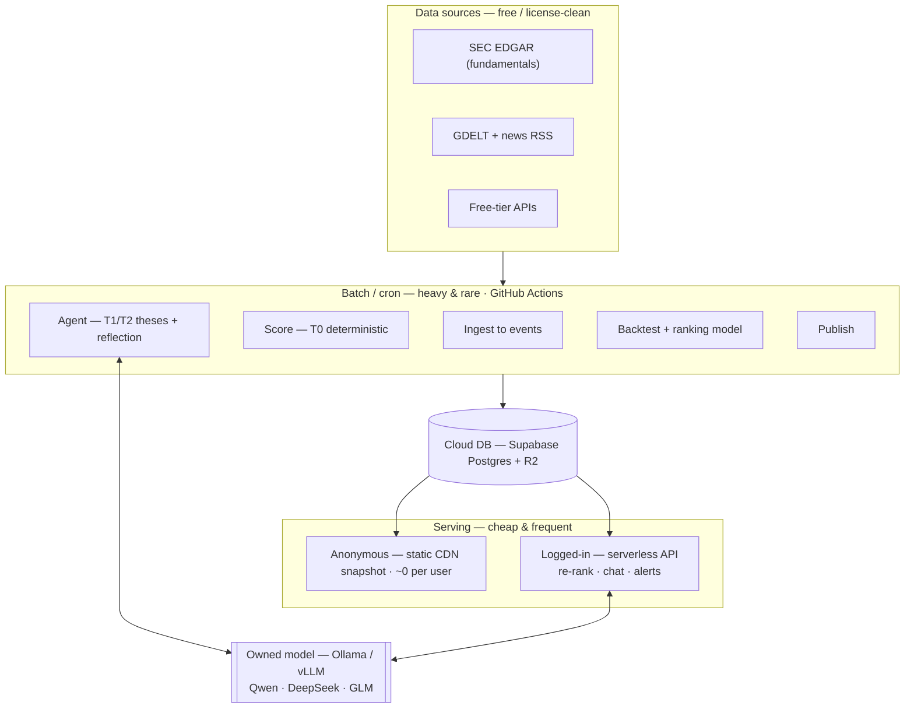

# Architecture: from "instrumented analytics" → an agentic equity-research platform

> Status: design doc (not yet built). Target for the next phase of work.
> Companion to `README.md`. Backtest (Pillar 2) is deferred until stock-level data
> (Pillar 6) lands — by owner's decision.

---

## 0. Where we are vs where we're going

**Today** the system is *automated and instrumented*, not agentic: a fixed weekly
pipeline (fetch → score → rank → narrate → publish a static JSON the dashboard
reads). It has a real prediction ledger and a market-feedback *measurement*, but the
LLM is a stateless narrator, "learning" is 4 hand-tuned weights, user feedback is a
global localStorage dead-end, it has never been validated, and it takes no action.

**Target** is an agent that: investigates the markets it flags, writes falsifiable
theses and grades itself, learns a validated ranking model from history, personalises
per user, **acts** (alerts + a public paper-portfolio track record), runs on an
**owned, auto-upgradeable** open model, ingests **stock-level + near-real-time news**
data, and does all of this at **~$0 today**, scaling cost only with users.

### Your questions → where they're answered
| Question | Pillar / section |
|---|---|
| Make it production-grade | §6 readiness + P4 safety + P7 infra |
| User access without spending much | P3 + P7 (anonymous CDN fast path; logged-in thin layer) |
| Data stored in cloud | P6 + P7 (Supabase Postgres + Cloudflare R2) |
| Users able to interact | P3 (auth, personalisation) + P1 (agent chat) + §5 UX |
| Stock-level data | P6 (SEC EDGAR-first, license-clean) |
| Real-time news / live updates | P6 (GDELT/EDGAR/RSS → event→signal → incremental scorer) |
| Train a model in my own environment | P5 (Ollama/vLLM) + P2 (the deterministic ranker is the cheaply-trainable model that moves P&L) |
| Auto-upgrade the model (Qwen2.5→Qwen3) | P5 (registry + golden-eval gate + upgrade controller) |
| Cost ~0 now | §4 model routing + §7 cost ladder |
| Better user interaction | §5 UX |
| What's unique / why use it | P8 (the wedge + moat) |
| How we make money | P8 (monetisation) |

---

## 1. Design principles

1. **Deterministic spine, LLM at the edges.** All scoring/ranking/backtest math is
   plain Python (free, exact, auditable). The LLM never writes into scores — it
   investigates, narrates, and advises. This is both a cost decision and a safety one.
2. **Right model for the right task** (the central cost lever — §4). Frequency × stakes
   decides the tier; high-frequency customer work runs on cheap/owned models, frontier
   is reserved for rare weekly jobs.
3. **Free-first, degrade gracefully.** Every paid dependency has a free tier and a
   deterministic fallback. With no API keys and no internet, the core still runs.
4. **Own your model.** One provider-abstraction interface; the reasoning model is a
   swappable, self-hostable open model (Qwen/DeepSeek/GLM), upgraded by a gated config line.
5. **Falsifiability as the product.** Every call is logged with a *fixed* evaluation
   date and graded against outcomes. The public track record *is* the moat.
6. **Two-speed compute.** Heavy, rare work (weekly batch, backtest, model retrain,
   frontier reasoning) runs in CI/cron; cheap, frequent work (reads, user chat) is
   serverless + CDN.

---

## 2. The model-routing strategy (the cost lever)

Cost is dominated by *who runs how often*. Route by **frequency × stakes**:

| Tier | Tasks | Frequency | Model (now → scale) | ~Cost |
|---|---|---|---|---|
| **T0 deterministic** | scoring, ranking, metrics, backtest, alerts rules | every run | **no LLM** (pandas/numpy) | $0 |
| **T1 cheap / owned** | user chat & Q&A, explanations, per-market tags, **news event extraction** | **high** (per user, near-real-time) | **self-hosted Qwen2.5/3 7–32B** (Ollama→vLLM) · or **GLM-4-Flash** (free), **DeepSeek-V3**, **Qwen-Turbo** | ~$0–0.001/call |
| **T2 reasoning (cheap)** | weekly thesis synthesis, reflection / self-grading | weekly (low) | **DeepSeek-R1** or self-hosted **Qwen3-32B** | cents/week |
| **T3 frontier** | backtest interpretation, model-upgrade eval, hardest judgment | one-off / weekly | **Claude Opus/Sonnet** (or DeepSeek-R1) | rounding error (runs ~1×/week) |

**Why this is ~$0 now:** the only *frequent* LLM work is T1, and T1 runs on a model
you own (Ollama on your Apple-Silicon Mac, free and unlimited) or a free hosted tier
(GLM-4-Flash, Groq). Frontier (T3) is so infrequent its price is negligible.

### Provider abstraction + the Chinese-model menu
One interface, `model_id = "scheme:model"`, makes every provider interchangeable.
Because Ollama, vLLM, Groq, OpenRouter, DeepSeek, Z.ai/GLM, and Qwen all speak the
**OpenAI `/v1/chat/completions`** API, a *single* `OpenAICompatProvider` (base_url +
key) covers all of them; only Anthropic needs its own adapter.

```
config/models.yaml
  roles:
    cheap:  { champion: "ollama:qwen2.5:7b-instruct",     candidate: null, canary_pct: 0 }
    smart:  { champion: "openrouter:deepseek/deepseek-r1", candidate: null }
    agent:  { champion: "ollama:qwen2.5:32b-instruct",    candidate: null }
    frontier:{champion: "anthropic:claude-opus-4-8" }
  models:
    "ollama:qwen2.5:7b-instruct":     { provider: ollama,    base_url: http://localhost:11434/v1, unit_cost: 0 }
    "openrouter:z-ai/glm-4.5":        { provider: openrouter, api_key_env: OPENROUTER_API_KEY }
    "openrouter:deepseek/deepseek-r1":{ provider: openrouter, api_key_env: OPENROUTER_API_KEY }
    "anthropic:claude-opus-4-8":      { provider: anthropic,  api_key_env: ANTHROPIC_API_KEY }
```

**Candidate Chinese/open models** (all OpenAI-compatible, self-hostable or via OpenRouter):
- **Qwen** (Alibaba, Apache-2.0) — Qwen2.5 / Qwen3, 0.5B–235B; the default *owned* model. `ollama pull qwen3`.
- **DeepSeek** (MIT) — **V3** (cheap strong chat), **R1** (cheap reasoning) for T2.
- **Z.ai / Zhipu GLM** — **GLM-4-Flash** (free tier), GLM-4.5/4.6 (cheap, strong); GLM open-weights for self-host.
- Aggregator: **OpenRouter** exposes all of the above (some free) behind one key + one base_url.

### Auto-upgrade (Qwen2.5 → Qwen3 as a gated one-liner) — Pillar 5
1. A monthly GitHub Action discovers newer tags, pulls the **candidate**.
2. **Golden-eval harness** grades candidate-vs-champion on ~30 replayable past
   scoreboards + past theses (schema-validity, faithfulness = only names markets in
   the payload, agreement, cost, latency). The judge itself runs on the *free* tier.
3. If the candidate is **non-inferior in quality AND ≤ cost AND within latency**, it
   opens a PR flipping the `champion:` line; otherwise it logs why. Canary = run on
   N% of live traffic into a shadow column first. Rollback = revert the commit.

---

## 3. Target architecture



Text fallback:

```
                    ┌────────────────────────── BATCH / CRON (rare, heavy) ──────────────────────────┐
  Data sources      │  GitHub Actions (weekly + 15-min pollers, free)                                 │
  ─────────────     │   ├─ engine/sources/*  EDGAR (stock fundamentals), Massive/Polygon.io (prices)  │
  SEC EDGAR (free)  │   ├─ engine/ingest/*   GDELT + SEC filings + news RSS  → events table           │
  GDELT (free)      │   ├─ metrics/score (T0 deterministic)                                           │
  news RSS (free)   │   ├─ engine/agent/*    bounded ReAct agent (T1/T2) → theses + lessons (memory)  │
  free-tier APIs    │   ├─ engine/backtest + model  (P2, after stock data)                            │
                    │   ├─ engine/upgrade    golden-eval model swap (monthly)                          │
                    │   └─ engine.publish → Postgres + versioned JSON → R2/CDN                         │
                    └───────────────┬───────────────────────────────────────────────────┬────────────┘
                                    │ writes                                             │ reasoning
                        ┌───────────▼────────────┐                          ┌────────────▼───────────┐
                        │  Cloud DB (Supabase     │                          │  Owned model           │
                        │  Postgres + Auth + RLS) │                          │  Ollama (dev) /        │
                        │  predictions, accuracy, │                          │  vLLM-on-Modal (scale) │
                        │  theses, users, feedback│                          │  Qwen / DeepSeek / GLM │
                        └───────────┬─────────────┘                          └────────────┬───────────┘
                                    │                                                     │
       ┌──── ANONYMOUS (free, fast) ┴───────┐         ┌──── LOGGED-IN (thin dynamic) ─────┴─────────┐
       │ Static dashboard on Vercel/CF Pages│         │ Serverless API (Supabase Edge / Vercel fns) │
       │ reads cached snapshot JSON via CDN │         │ personalised re-rank, feedback, agent chat, │
       │ (R2/SWR) — $0 per extra user       │         │ alerts (Resend email / Web Push)            │
       └────────────────────────────────────┘         └─────────────────────────────────────────────┘
```

**Key split:** anonymous users hit a CDN-cached snapshot (cost per extra user ≈ $0);
only logged-in users touch the dynamic layer. Heavy/rare LLM + compute lives in
batch; frequent cheap LLM (chat) runs on the owned model.

---

## 4. The eight pillars (concise)

### P1 — The LLM Agent Brain (tools + memory + reflection)  ✅ LANDED, v1 (2026-07-23)
`engine/agent/` (`select.py`/`tools.py`/`react.py`/`reflect.py`/`agent.py`) — bounded
ReAct loop, 5 whitelisted tools, thesis writing + reflection-based grading, all shipped
as designed below. Gated behind `engine.cli refresh --agent` (default off — see
docs/STATUS.md for the `refresh.yml` activation decision still pending). Real
deviations from the original spec, recorded in ADR-020/021: no tool-use API exists in
`llm.py`, so tool selection is a manual JSON-action loop, not native function-calling;
`role="analyst"` runs on the shared agent chain (T1≈T2 in practice — see §2's note),
not a distinct T2 tier; `fetch_news` is Google News RSS, not GDELT. Still missing:
personalization, a real T2/T3 model-tier split once a provider abstraction exists.

A new optional `engine/agent/` stage runs **between** surfacing and brief generation.
The deterministic engine **gates** it: it picks 3–8 genuinely ambiguous markets per
run (value-trap candidates, thin-coverage GARP, big rank moves, theses due for
re-check) and hands *only those* to a **bounded ReAct loop** (MAX_STEPS=4, hard
token/cost budget). Whitelisted tools: `query_ledger`, `get_market_detail`,
`fill_growth_gap` (re-run growth for one market's holdings), `fetch_news`,
`write_thesis` (the only mutation). It writes a **thesis** (claim + direction + FIXED
eval date + confidence + evidence) to memory; a **reflection** pass grades matured
theses against outcomes and distills **lessons** injected into future prompts.
*Advises only — never writes into scores.* Runs on T1 (tool turns) + T2 (synthesis);
degrades to today's deterministic fallback. **Target < $0.05/week.** This is the
change that finally justifies an LLM at all.

### P2 — The Learning Engine (validation + ranking model)  *(deferred until P6 stock data)*
`engine/backtest.py` walk-forward harness over a `prices` table (one-time historical
backfill) with **fixed multi-horizon labels** (63/126/252 trading days) — fixing the
current "grade-to-today" bias and the horizon mismatch. Replace the 4 hand-tuned
weights with a **cross-sectional ranking model** (LightGBM LambdaRank, or sklearn
ridge/logistic fallback) trained walk-forward, behind **anti-overfit + significance
gates**. `tuning.py` is repurposed as a thin online layer that only nudges within
gates. *This is the model "trained in your environment" that actually moves returns —
and it trains in seconds on CPU.*

### P3 — Multi-user backend (closing the user loop)
**Supabase** (hosted Postgres + Auth + Row-Level-Security). `engine.publish` writes
each run to Postgres; serverless functions serve **per-user personalised re-rank**
(a `user_vector` learned from that user's pins/dismissals) and persist feedback
*server-side* (fixing the localStorage dead-end). Pins become `user_predictions`
graded by the same outcome plumbing — so user feedback is **reconciled with reality**,
not just collected. Frontend stays no-build (supabase-js via CDN); anonymous users
keep the free static path.

### P4 — Actuation, Safety & the Public Path
The "**act in the world**" layer: `engine/alerts.py` (transition-based threshold
rules → market enters GARP / a held thesis breaks) dispatched via `engine/notify.py`
(**Resend** email free tier / Web Push / webhook); and `engine/portfolio.py` — a
**benchmarked paper portfolio** that turns rankings into a falsifiable, public track
record (**no real trading**). Plus the compliance scaffold: **LICENSE**, persistent
**"not investment advice"** disclaimer, "experimental/unvalidated" framing until the
backtest exists, and **auth + rate-limit** on any write endpoint.

### P5 — Ownable model + Auto-Upgrade  *(see §2)*  ⚠️ LANDED, scoped-down v1 only (2026-07-23)
`engine/modelupgrade.py` ships a threshold advisory over the already-populated
`model_scorecard` view (flags weak configured-chain models for demotion, strong
out-of-chain models for promotion; never auto-mutates config — see ADR-019). Still
UNBUILT: the `models.yaml` provider registry, the golden-eval gate, and any upgrade
controller that actually swaps models — this is a scorecard-threshold advisory, not
the full pillar. Revisit if/when the model roster outgrows manual `.env` chain edits.

Provider abstraction + `models.yaml` registry + golden-eval gate + upgrade
controller. Ollama locally now ($0), vLLM-on-Modal (scale-to-zero) later. Honest
training stance: **RAG over your own thesis/outcome ledger first**, lightweight
**LoRA** (Unsloth on free Colab/Kaggle T4, or local MLX) only later — and remember
the *deterministic ranker (P2) is the model that actually matters and is free to train*.

### P6 — Real-time + stock-level data (license-clean)
Replace the **ToS-violating yfinance** dependency with a `SourceAdapter` registry:
**SEC EDGAR first** (public-domain XBRL `companyfacts` + financial-statement
datasets — redistributable, solves the licensing blocker for US names) + free-tier
adapters (Massive/Polygon.io, FMP, Finnhub, Tiingo) load-balanced; honest about non-US gaps.
**Near-real-time:** GitHub Actions pollers (every 15–30 min) ingest **GDELT** +
**SEC filings** + news RSS into an `events` table; a **T1 LLM extractor** turns an
event into a structured signal; an **incremental scorer** recomputes only affected
markets. Stock-level fundamentals unlock Phase-2 bottom-up GARP (and the backtest).

### P7 — Near-zero-cost infrastructure
Frontend: **Vercel/Cloudflare Pages** (free). DB/Auth: **Supabase** free (500 MB,
50k MAU). Object storage: **Cloudflare R2** (10 GB, zero egress). Batch: **GitHub
Actions** (2,000 free min/mo). Serverless: **Supabase Edge / Vercel functions** free.
Email: **Resend** (3k/mo free). Model: **Ollama** local ($0) → Modal-vLLM scale-to-zero.
Observability: **Sentry** free. Migration path: SQLite → Supabase Postgres (or SQLite
+ Litestream → R2 as an interim).

### P8 — Differentiation, Moat & Monetisation  *(see §8)*

---

## 5. How users interact (UX)

- **The 1-minute answer first.** Anonymous landing = the global GARP/value/growth read
  + the surfaced insights, no login. (Already true; keep it.)
- **Ask the agent.** A chat box backed by T1 (owned Qwen): "Why is South Africa flagged
  GARP?" → the agent answers from the scoreboard + its thesis memory, cheaply.
- **Personalised watchlist + re-rank** (logged-in): pin markets, set a risk lens; the
  board re-ranks for you and your pins become graded predictions.
- **Alerts** (the first real "action"): "tell me when an EM enters GARP" → email/push.
- **The track record is front-and-centre** — every call is public and graded; users
  can see whether the engine (and their own pins) actually worked.

---

## 6. Production-readiness checklist
- [ ] LICENSE + persistent "not investment advice" disclaimer + "experimental" badge
- [ ] Off scraped Yahoo → EDGAR/free-tier license-clean sources (public gate)
- [ ] Cloud DB (Supabase) replacing local SQLite; secrets in env, never committed
- [ ] Auth + rate-limiting on every write/compute endpoint; RLS on user data
- [ ] Per-user feedback (kills the global-pool + localStorage dead-end)
- [ ] Fixed-horizon grading (kills the look-ahead/horizon bias) + significance gates
- [ ] A real backtest before any "track record" is presented as trustworthy
- [ ] Error tracking (Sentry) + uptime + cost dashboard (`model_runs` table)
- [ ] Security & privacy: Postgres RLS on user rows, secrets in env only, no PII in
      logs, account data export/delete, ToS + privacy policy

---

## 7. Cost ladder

| Stage | Frontend | DB/Auth | Storage | Batch | Model | Email | **$/mo** |
|---|---|---|---|---|---|---|---|
| **Now → ~100 users** | Vercel Hobby $0 | Supabase free | R2 free | Actions free | Ollama local $0 | Resend free | **~$0** |
| **~1k users** | $0 | Supabase free/Pro $25 | R2 free | Actions free | Modal-vLLM (scale-to-zero) ~$5–20 burst | Resend free | **~$25–45** |
| **~10k users** | Pro $20 | Supabase Pro $25 + usage | R2 ~$5 | Actions/Modal ~$30 | vLLM GPU hours ~$50–150 | Resend $20 | **~$150–250** |

The static-snapshot CDN model means **anonymous traffic is ~free at any scale**; cost
grows only with *logged-in* compute and *owned-model* inference.

---

## 8. Moat & monetisation

**Landscape:** Bloomberg/Refinitiv (pro, $$$$, terminal), Koyfin/TIKR/Atom (data
terminals), Simply Wall St (retail visuals), finviz/Yahoo (free screeners),
Seeking Alpha/Stockopedia (ratings/commentary). **All are either data terminals you
dig through, or opaque ratings that never show whether they work.**

**The wedge (why someone uses this):**
1. **Top-down index + bottom-up stock GARP, unified and globally comparable** — most
   tools are stock-only or single-market; nobody puts "which *market* is cheap+growing"
   and "which *stock* within it" on one within-peer-group scale.
2. **An agent that does the research → a 1-minute answer**, not a terminal to mine.
3. **A public, falsifiable track record** — the engine grades its own calls in the
   open. Almost no competitor will show you if their signals actually predicted anything.
4. **Agentic theses with memory** — it remembers what it said and reconciles it later.

**Moat (compounding):** the proprietary **outcome/track-record dataset** (a data
flywheel that grows every week and can't be back-dated), a **user-feedback network
effect**, the **learning loop**, and **trust via transparency**.

**Monetisation (freemium):**
- **Free:** weekly global index read, the public track record, limited agent questions.
- **Pro (~$15–30/mo):** real-time updates, alerts, stock-level drill-down,
  personalised re-rank, unlimited agent chat, paper-portfolio tracking.
- **API / data (~$50–200/mo):** the scored panel + track record via API.
- **White-label** for advisors; **affiliate/brokerage** referral (compliance-gated).
- **Regulatory framing:** strictly *information/research, not advice* → avoids RIA
  registration. Billing via **Stripe** (no fixed cost).
- **First 3 revenue experiments:** (1) gate alerts + stock drill-down behind Pro;
  (2) a paid weekly "what changed + why" agent digest; (3) an API key for the panel.

---

## 9. Phased roadmap (build order)

> Each phase is independently shippable and keeps the $0 path intact.

- **Phase 0 — Safety & honesty (S):** LICENSE, disclaimer, "experimental" badge,
  fixed-horizon grading + significance gate, IC population guard. *Unblocks public.*
- **Phase 1 — Own the model (S–M):** provider abstraction + `models.yaml` + cost
  logging; wire Ollama-local; route T1/T2/T3 per §2. *Delivers the model strategy.*
- **Phase 2 — Cloud + multi-user (M):** Supabase (Postgres+Auth), `engine.publish`,
  server-side per-user feedback, anonymous CDN fast path. *Data in cloud + users interact.*
- **Phase 3 — Data layer (M–L):** EDGAR-first license-clean sources; events ingestion
  (GDELT/EDGAR/RSS) + T1 extractor + incremental scorer. *Stock-level + real-time.*
- **Phase 4 — The agent (M):** bounded ReAct loop + thesis memory + reflection (P1);
  agent chat in the UI. *Genuinely agentic + the paid product.*
- **Phase 5 — Act (M):** alerts + paper portfolio (P4). *First real actions + track record.*
- **Phase 6 — Learn (L):** backtest + ranking model (P2) — *now* that stock-level
  history exists. *Validated learning.*
- **Phase 7 — Auto-upgrade + monetise (M):** golden-eval + upgrade controller (P5);
  Stripe + freemium gating (P8).

**Recommended first build: Phase 0 + Phase 1** — they're small, make the live site
honest, and deliver your "right model for the right task / own the model" requirement
immediately at $0.

---

## 10. Definition of "agentic" — acceptance criteria

We can claim "agentic" (not "automated") when **all** of these are true. Use it to
measure progress, not vibes:

- [ ] **Perceives** beyond a fixed pull — ingests events/news that it didn't schedule.
      (`fetch_news` fetches on-demand, but only inside an already-scheduled run —
      not a standing perception loop. Partial, left unchecked.)
- [x] **Decides its own method** — `engine/agent/select.py`'s gate is a real branch
      (value trap / thin-coverage GARP / big rank move / thesis due → investigate,
      else skip), and the ReAct loop's per-step tool choice is real branching too.
- [x] **Uses tools to investigate** — the Analyst agent (P1, landed 2026-07-23) calls
      `query_ledger`/`get_market_detail`/`fill_growth_gap`/`fetch_news` to gather
      evidence before concluding, not just narrating a finished table.
- [x] **Has memory + reflection** — `write_thesis` records claim + direction + FIXED
      eval date + confidence; `reflect.py` grades matured theses against realized
      returns and feeds outcomes into semantic memory for future prompts.
- [ ] **Acts in the world** — at least one real action (alert / paper-portfolio
      trade) that affects something beyond the dashboard.
- [ ] **Learns, validated** — a backtested model (not 4 hand weights) whose skill is
      measured out-of-sample and gated for significance. (The mechanism landed
      2026-07-22 and ran against real data; not re-assessed as part of this pass.)
- [ ] **Closes the user loop** — per-user feedback reconciled with realized outcomes.

Today (2026-07-23): 3 of 7 confirmed (tools / branching / memory+reflection, all from
the Analyst agent). Phase 5 (alerts + paper portfolio) and Phase 2/6 (per-user
feedback) are what's left to close the remaining 4.

---

## 11. Risks, assumptions & open decisions

**Assumptions**
- The signals have *some* predictive skill. **Unproven** — the backtest (P2/Phase 6)
  is the test. Until then the UI must say "experimental/unvalidated."
- Free tiers stay free enough at low scale (true today; monitor Supabase/Actions/Modal).

**Risks**
- **Non-US fundamental coverage.** EDGAR solves US cleanly; non-US stock-level
  fundamentals have *no* great free, license-clean source — likely needs a paid
  provider (e.g. FMP/Tiingo paid) for global Phase-2. Index-level proxies stay free.
- **Self-hosted model quality vs frontier.** Qwen/DeepSeek are strong but a 7–32B
  owned model may underperform Opus on hard reasoning — the golden-eval gate + the
  T2/T3 split (frontier for the rare hard jobs) is the mitigation.
- **Cost creep from per-user LLM chat.** Cap free-tier agent questions; meter Pro.
- **Compliance.** "Research, not advice" framing must be enforced in copy + product;
  revisit if we ever personalize into anything resembling a recommendation.
- **Data flywheel cold-start.** The track-record moat is weak until enough graded
  weeks accrue; the backtest backfill bootstraps it.

**Open decisions (need your call when we build)**
1. Cloud DB: **Supabase** (Postgres+Auth+RLS, batteries-included) vs Neon+Clerk. *Lean Supabase.*
2. Owned model default: **Qwen2.5/3-32B** vs DeepSeek-V3 for the `agent` role.
3. Hosting: keep **Vercel** (already live) vs move to Cloudflare Pages+Workers.
4. How aggressive auto-upgrade is: PR-with-review vs auto-merge on high gate margin.
5. Free vs Pro line: where exactly alerts / stock-drill-down / real-time sit.
