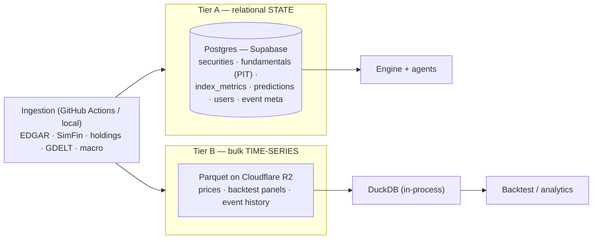

# Roadmap & Build Plan

> Companion to [ARCHITECTURE.md](ARCHITECTURE.md) (target design) — this is the
> *sequenced plan*. Phase 1 is detailed; later phases are deliberately light and will
> be expanded as we get there. Status today: Phase 0 (Phase-1 index product) is live;
> the work below takes it from "static rules" to a validated, agentic, public product.

## Guiding principles
1. **Data foundation first.** Without well-structured, point-in-time data, the
   intelligence is useless.
2. **Validate before trusting.** Nothing becomes a signal until a backtest/event-study
   shows it predicts something.
3. **Cloud-agnostic, open formats.** Postgres + Parquet + DuckDB → zero lock-in; move to
   AWS/GCP later only if scale/funding demands, with near-zero rewrite.
4. **Right model for the right task; $0 now, cost scales with users — not data.**

---

## Data architecture (two-tier, cloud-agnostic)

Financial data is small and cheap *except* bulk time-series, which is the wrong fit for
row-store Postgres. So we split storage by access pattern:

- **Tier A — Postgres (Supabase free tier):** relational, queryable, transactional state
  that needs joins / ACID / row-level security for multi-user. Stays < 500 MB → **free**.
- **Tier B — Parquet on object storage (Cloudflare R2) + DuckDB:** daily/intraday prices,
  full backtest panels, event history. Columnar, ~10× compressed, vectorized scans, runs
  in-process (local or CI) with no DB server. Scales to **billions of rows for single-digit
  $/mo** (R2: 10 GB free, zero egress). **The backtest reads Parquet directly.**

**Non-negotiable schema rule: point-in-time + provenance on every row.** Store fundamentals
as they were *filed* (with filing/effective dates), prices up to each date, and **index
membership as-of** — so any backtest uses only what was knowable then (no look-ahead, no
survivorship bias), and every value carries its `source`.

**Why this stack (not AWS/GCP now):** $0, fast, batteries-included (auth/REST/RLS), and
**open formats mean no lock-in** — Postgres→RDS/Cloud SQL is a dump/restore, Parquet→S3/GCS
is a copy, DuckDB reads the same Parquet that Athena/BigQuery do. Adopt a single big cloud
only at real scale/funding/compliance. *(One likely early exception: GDELT is a free public
BigQuery dataset — we may query it there while the rest stays lean.)*

**Cost:** ~**$0** through Phase 1; **≤ $25/mo** even with full historical price+fundamental
history (Supabase Pro only when state > 500 MB or you want no-pause + backups; R2 ~free).

---

## Phase 1 (CURRENT) — Data foundation

*Goal: clean, cloud-hosted, point-in-time data at index **and stock** level, in a format
the intelligence can actually use.*

**1a. Stand up the two-tier store**
- Supabase project (Postgres + Auth + Storage). Cloudflare R2 bucket for Parquet.
- Schema (Tier A), all with `asof` + `source`:
  - `securities` (id, ticker, name, country, currency, sector, CIK/ISIN/FIGI)
  - `indices` (key, name, proxy_etf, country, region, kind)
  - `index_constituents` (index_key, security_id, weight, **asof**)
  - `fundamentals` (security_id, period_end, fiscal_year, filed_date, revenue, net_income,
    equity, shares, … + derived growth, **source**)
  - `index_metrics` (index_key, **asof**, value/growth/opportunity/pe/pb…) — historized
  - migrate existing engine state: `predictions`, `accuracy`, `data_sources`,
    `source_evals`, `feedback`
- Tier B (Parquet on R2): `prices/` (security_id, date, close, …, partitioned by date),
  later `events/` and `backtest_panels/`.
- A thin data-access layer so the engine reads/writes Postgres + reads Parquet via DuckDB.

**1b. Stock-level ingestion (license-clean, via the data-ingestion agent's adapters)**
- **SEC EDGAR adapter** first (US, public-domain, no key, highest quality: companyfacts
  XBRL → standardized fundamentals + filing dates → point-in-time).
- **SimFin** (needs free key) for broader standardized coverage.
- **Constituent ingestion** — index holdings (ETF holdings files) → `index_constituents` +
  link to `securities`; **store membership history** (as-of) for survivorship-safe backtests.
- **Prices** — EOD for stocks + index proxies into Parquet (chunked backfills in CI).
- Non-US starts: EDINET (Japan) / filings.xbrl.org (EU/UK) — scaffold.

**1c. Start capturing news + macro (log now, use later)**
- Ingest into `events` (meta in Postgres, history in Parquet): GDELT + filings + RSS, and
  **structured macro** (FRED/ECB/World Bank/DBnomics: rates, inflation, FX, GDP, PMI).
- Even before it drives anything, **accruing this history now** is what makes Phase-2
  validation possible.

**1d. Wire it together**
- Point the engine + data-ingestion agent at the new store; the agent scores sources on
  real stored data and persists quality history in the cloud.

**Done when:** US stock fundamentals + index constituents (with history) + prices are
flowing into the two-tier store on a schedule — queryable, source-tagged, point-in-time —
the engine reads from it, and news/macro is being logged. *(Using the stock data for
bottom-up scoring + backtest is Phase 2; Phase 1 is getting good data in, well-structured.)*

---

## Backtesting — how it works (built in Phase 2, enabled by Phase 1's data)

**Initial (historical, walk-forward, point-in-time):**
- At each historical rebalance date *t* (e.g. monthly), compute scores using **only data
  known as-of *t*** (filed fundamentals lagged for filing delay; prices ≤ *t*; membership
  as-of *t*).
- Form portfolios from the rankings; measure forward returns at **fixed horizons
  (1/3/6/12m)**.
- Metrics: **rank-IC** (does score predict forward return?), top-vs-bottom decile spread,
  hit-rate, basket Sharpe vs benchmark (ACWI) — net of costs, optionally sector/region-neutral.
- Output: **per-signal IC by horizon** → which of value/growth/momentum actually works and
  over what horizon (this fixes today's tuner horizon mismatch). Controls: survivorship
  (delisted included), filing lag, transaction costs.

**Continuous (forward, live):** the *same engine + metrics*, extended in time — each
prediction is logged with a **fixed eval date**, graded as its horizon matures, and
appended to the same out-of-sample record. Retrain/retune only on backtest + matured-live
data, behind **significance gates**, promoting a model only if it beats the incumbent on
held-out data. Add **drift monitoring** (alert if live IC diverges from backtest).

→ Both run on the point-in-time DB; the backtest *replays* history, continuous testing
*keeps appending*. This is why Phase 1's as-of + provenance discipline is mandatory.

---

## News / unstructured + macro — the context layer

**Pipeline:** ingest events (GDELT, filings, RSS) + structured macro → **structure the
unstructured** with the *cheap* LLM tier (Qwen/GLM/Haiku): item → `{entity, event_type,
sentiment, magnitude, novelty}` → link to securities/indices.

**Two uses, validated in order:**
- **(a) Context + explanation + alerts — early, low-risk.** Attach recent material events +
  macro regime to each market so briefs can explain *why* ("China cheap **and** stimulus +
  rate-cut cycle = tailwind") and fire alerts. Does **not** touch scores.
- **(b) A scoring signal — only after validation.** Measure the news→price effect with an
  **event study**: align an event class (earnings beat, downgrade, macro surprise) to
  **abnormal returns** (actual − benchmark) over a window (CAR); only signals that pass get
  added as model features. Macro enters as **regime features** the same way.

**Honest take:** news→price is noisy and decays fast — so it's **context + alerting first**,
a **scoring signal only after event-study/backtest validation**.

**Phasing:** capture in **P1** (accrue history) → event-study/feature-test in **P2** →
agent thesis-context in **P3** → real-time news alerts in **P4**.

---

## Phase 2 (lighter) — Validated intelligence
- Backtest harness (above) on the two-tier data → does it predict anything?
- Replace hand-tuned rules with a **validated walk-forward ranking model**; fixed-horizon
  grading; significance-gated promotion.
- **Bottom-up GARP** from constituents (not ETF proxies); event-study on news/macro features.

## Phase 3 (light) — The agent brain
- LLM **research/analyst agent**: bounded ReAct loop, tools (query ledger, fetch news, fill
  data gaps), **thesis memory**, **self-grading reflection**; model routing; self-hosted/
  owned auto-upgradeable model.

## Phase 4 (light) — Product & users
- Multi-user backend, auth, per-user personalization, **alerts**, paper-portfolio track
  record; real-time news pipeline.

## Phase 5 (light) — Public launch & monetization
- License-clean data everywhere, auth + rate-limiting, freemium tiers, model auto-upgrade.

---

## Open decisions (locked unless you say otherwise)
- **DB:** Supabase Postgres (Tier A) + Cloudflare R2 Parquet / DuckDB (Tier B). ✅ recommended
- **First stock source:** SEC EDGAR (US, free, no key). ✅ recommended
- **Cloud posture:** stay lean + cloud-agnostic now; revisit AWS/GCP at scale. ✅ recommended
